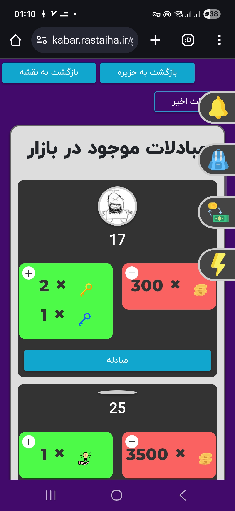
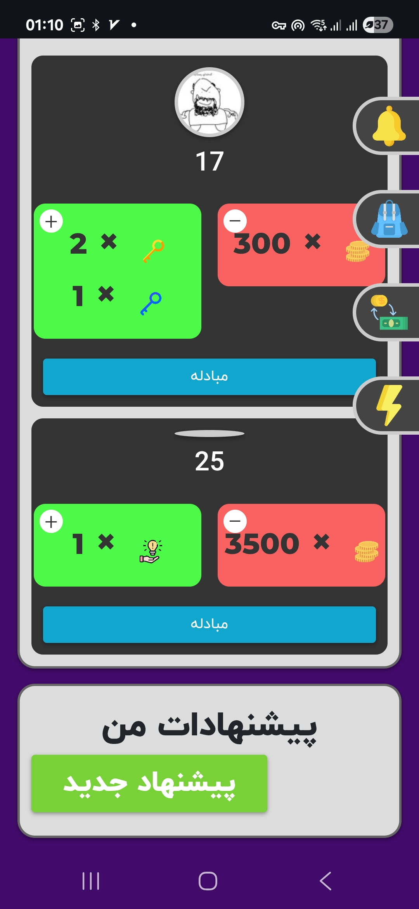
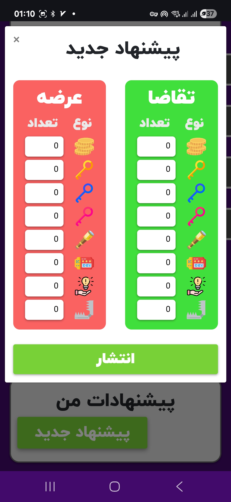

# سند فاز سوم بازی برمودیا

## 🎯 هدف کلی فاز  

در این فاز به دنبال پیاده‌سازی منطق ارزش دارایی‌های مختلف در بازی هستیم.

---

## 📌 فیچرهای فاز سوم  

### ⚓ لنگراندازی  

- هر گاه کاربر بخواهد وارد یک جزیره شود، باید در آن لنگراندزی کند.  
- لنگر انداختن هزینه‌ی ثابت `anchoring_cost` را دارد (رجوع به بخش [سکه](#-سکه)).  
- برداشتن لنگر هزینه‌ای ندارد و خود به خود با سفر به جزیره‌ی بعدی اتفاق می‌افتد.  

---

### 🌍 سفر بین قلمروها  

- هر قلمرویی یک جزیره‌ی شاه‌راه دارد که در یکی از گوشه‌های قلمرو قرار دارد.  
  - این جزیره محتوایی ندارد و قابل لنگراندازی نیست.  
  - از این جزیره می‌توان به شاه‌راه دیگر قلمروها سفر کرد.  

- **آخرین قلمرو**: آخرین قلمروی بکری که کاربر به آن وارد شده است.  
  - مثال: اگر کاربر به ترتیب در این قلمروها بوده باشد: `۱ → ۲ → ۱`، آخرین قلمرو کاربر ۲ است.  

- کاربر تنها زمانی حق دارد به قلمروی بکر دیگری برود که در آخرین قلمرو خود حداقل `minimum_acceptable_knowledge` را کسب کرده باشد.  
- در غیر این صورت باید مقدار ثابت `emigration_cost` را بپردازد (رجوع به بخش [سکه](#-سکه)).  

---

### 🪙 سکه  

سکه یکی از دارایی‌های بازیکن است.  

#### راه‌های کسب سکه  

- بازی‌ها: در جزیره‌های غیرآموزش، دانش‌آموز با حل سؤال جزیره سکه کسب می‌کند.  
- کلک‌خانه و قمارخانه (در فازهای بعدی اضافه خواهند شد).  

#### راه‌های خرج سکه  

- خرید سوخت  
- لنگراندازی (بخش [لنگراندازی](#-لنگراندازی))  
- خرج مهاجرت (بخش [سفر بین قلمروها](#-سفر-بین-قلمروها))  

---

### 🔑 کلید  

کلید یکی از دارایی‌های بازیکن است.  

- ۳ نوع کلید داریم: **آبی - قرمز - طلایی**  

#### راه‌های کسب کلید  

- حل سوالات علمی، به افراد کلید می‌دهد.  

(رجوع به بخش [گنج](#️-گنج))  

---

### 🏴‍☠️ گنج  

- در هر جزیره‌ی قابل لنگراندازی (علمی/چالش)، گنج نیز وجود دارد.  
- گنج‌ها بوسیله‌ی کلیدها باز می‌شوند (رجوع به بخش [کلید](#-کلید)).  
- هر گنج نیازمند مجموعه‌ای از کلیدهاست.  
- داخل گنج: **سکه** (بخش [سکه](#-سکه)) یا **آیتم‌ها (آیتم‌ها در فاز بعد)** قرار دارد.  

---

### 🏦 بازار مبادلات

هر کاربر می‌تواند در بازار مبادلات:

- پیشنهاد مبادله قرار دهد تا دیگران آن را قبول کنند.  
- پیشنهاد دیگران را ببیند و هر کدام را که خواست قبول کند.  

#### ساختار هر پیشنهاد  

- `offeredTradables`: آنچه پیشنهاددهنده می‌دهد.  
- `requestedTradables`: آنچه پیشنهاددهنده می‌گیرد.  

#### روش‌های حذف پیشنهاد  

1. کاربری جز پیشنهاددهنده، پیشنهاد وی را قبول کند.  
   - (بدیهی است کاربر دوم تنها زمانی می‌تواند پیشنهاد را قبول کند که `requestedItems` را داشته باشد.)  
2. پیشنهاددهنده، پیشنهاد خود را از بازار حذف کند.  

#### نکات  

- هر گاه پیشنهاددهنده پیشنهادی ثبت کند، به اندازه‌ی `offeredItems` از آیتم‌های خودش کم می‌شود و در گروی بازار قرار می‌گیرد.  
- اگر پیشنهاددهنده پیشنهادش را حذف کند، `offeredItems` به وی باز می‌گردد.  

**🔹 Tradables: [سکه](#-سکه), [کلید](#-کلید), Items (next phases)**  

  
  
  
  <figcaption style="text-align:center;">تصاویر بازار مبادلات کابار</figcaption>

